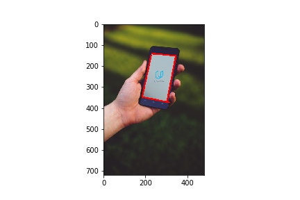
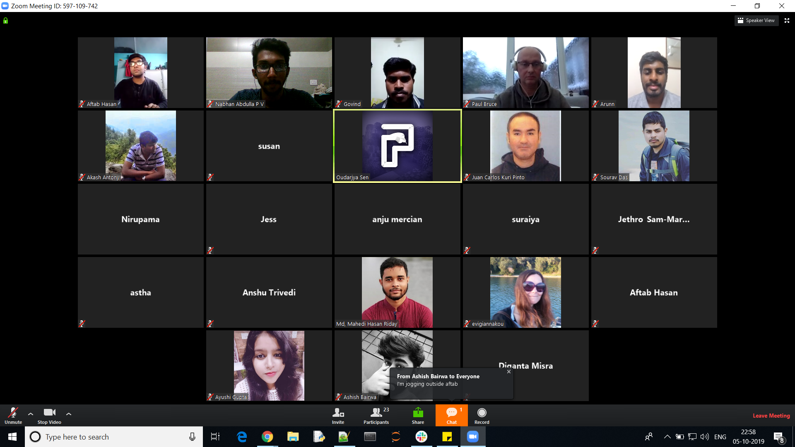
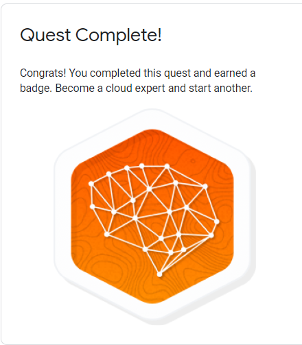
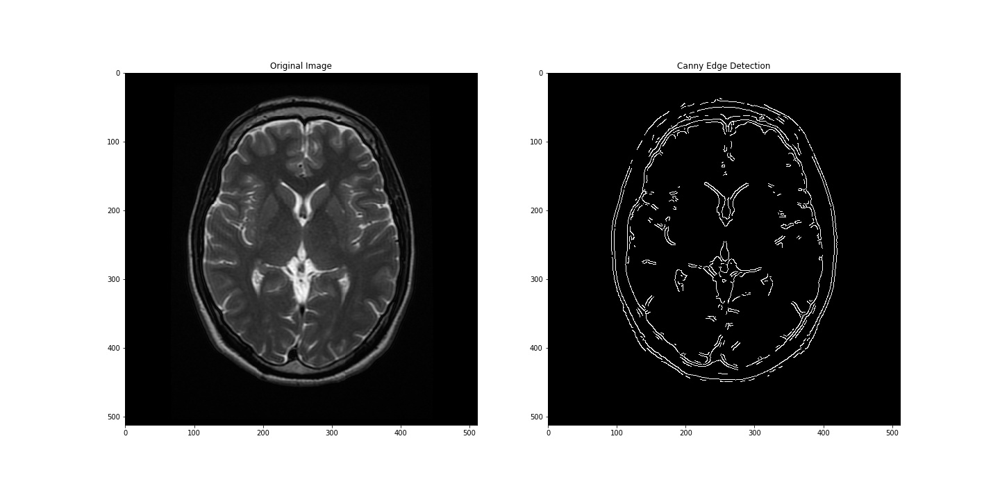
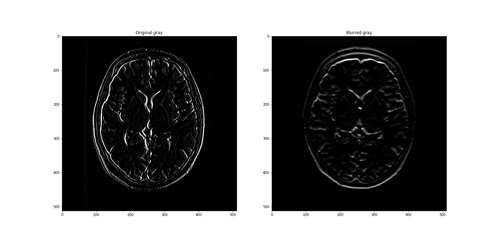
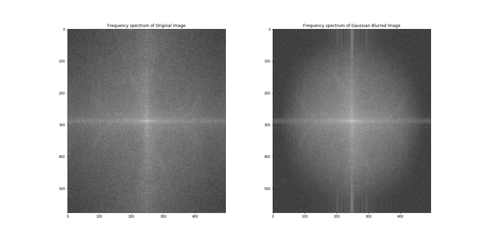
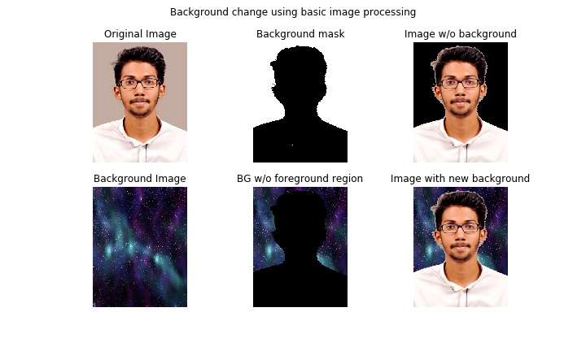
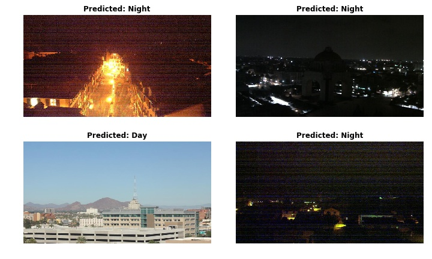

# 100daysofCVND 30daysofudacity
Updating and tracking progress for [#30daysofudacity](https://sites.google.com/udacity.com/udacity-community-guide/community/30daysofudacity) and #100daysofCVND while learning Udacity [Computer Vision Nanodegree](https://www.udacity.com/course/computer-vision-nanodegree--nd891) as part of [Secure and Private AI Scholarship Challenge 2019 (Facebook and Udacity)](https://sites.google.com/udacity.com/secureprivateai-phase-2/home?authuser=0)

## Day 21/100(November 23, 2019):

1. Tried out pre-trained pose estimation model

## Day 20/100(November 22, 2019):

1. Visualized trained model filters and output of images through the different filters for Fashion MNIST

## Day 19/100(November 21, 2019):

1. Classified and visualized Fashion MNIST
	
	
## Day 18/100(November 20, 2019):

1. Working on running [OpenPose](https://github.com/CMU-Perceptual-Computing-Lab/openpose) and [AlphaPose](https://github.com/MVIG-SJTU/AlphaPose) models

## Day 17/100(November 19, 2019):

1. Trying out running [OpenPose](https://github.com/CMU-Perceptual-Computing-Lab/openpose) model		

## Day 16/100(November 18, 2019):

1. Learnt about sequence2sequence models using attention from CVND
	- advantage of attention over normal seq2seq
	- multiplicative and additive attention
	- applications in computer vision and nlp
	
	
## Day 15/100(November 17, 2019):

1. Learnt about different hyperparameters for a neural network and some heuristics for setting these values
	- learning rate, batch size and iterations
	- no.of layers, choice between RNN/LSTM/GRU
	

## Day 14/100(November 16, 2019):

1. Continue learning about LSTM networks from CVND

## Day 13/100(November 15, 2019):

1. Learnt about the basics of LSTM from CVND
	- RNN fails for networks over 8-10 timesteps due to VANISHING GRADIENTS problem
	- Even though RNNs suffer from EXPLODING GRADIENTS(gradients uncontrollably increasing), gradient clipping can be done. Gradient clipping involves checking the gradient at each timestep to ensure it's value to be less than a threshold and if not normalizing it
	- LSTMs are a workaround for the vanishing gradient problem in RNNs and can support networks of over 1000 timesteps
	- Instead of weighted addition of input and previous state in RNN cell to produce the new state, LSTM cells use a combination of sigmoid, hyperbolic tangent, multiplication and addition operations and still is completely differentiable so that we can backpropagate through them
	- Sigmoid allows differentiating b/w info that has to be passed to next timestep/to be retained

## Day 12/100(November 14, 2019):

1. Learnt about RNNs from RNN lesson in CVND
	- folded and unfolded representation of RNN
	- updating weights using Back-Propogation Through Time(BPTT)
	
	
## Day 11/100(November 13, 2019):

1. Learning about RNN's from CVND lesson on RNN

## Day 10/100(November 12, 2019):

1. Got an introduction to one-shot learning, siamese networks and triplet loss used in siamese networks from [this blog](http://datahacker.rs/one-shot-learning-with-siamese-neural-network/)

## Day 9/100(November 11, 2019):

1. Trying to setup pose estimation model

## Day 8/100(November 10, 2019):

1. Learnt about RNNs from part of [this CS231n lecture](https://www.youtube.com/watch?v=yCC09vCHzF8)
	- RNNs can be used for applications where we need to work on sequential input/output
	- Some applications are image captioning, sentiment classification, machine translation and frame-wise video classification 
	- At each time step, the predictions are affected by the previous time steps
	- Data is processed in chunks due to memory reasons like batch size for images
	- The same function(dependent on the weights) is used for one round of processing over a batch of data

## Day 7/100(November 09, 2019):

1. Got an introduction to DeepDream, Neural Style Transfer and Adversarial examples on CNNs from [this CS231N lecture](
youtube.com/watch?v=ta5fdaqDT3M)

## Day 6/100(November 08, 2019):

1. Looked upon visualization techniques for what CNN's learning or what features of the image are different layers of a CNN focusing on from part of [this CS231N lecture](https://lnkd.in/fjNENZs)

## Day 5/100(November 07, 2019):

1. Performed garbage classification
	- Used a 3 layer CNN and got accuracy of 75.3% on training for 50epochs
	- Used pretrained VGG16 and fine-tuned the FC layer to get 84% accuracy by training for just 2 epochs
	- Dataset: https://lnkd.in/fQWSASM

## Day 4/100(November 06, 2019):

1. YOLO 
   - YOLO is a realtime object detection method as it doesn't generate region proposals
   - Instead of predicting classes and bounding box separately like in case of R-CNN models
	YOLO predicts a single vector of class probabilities and bounding box coordinates
   - YOLO divides images into grids of constant size and predicts output vectors for 
	anchor boxes in each grid 
	
	
## Day 3/100(November 05, 2019):

1. Completed **Advanced CNN Architectures** section of CV nanodegree
	* *Faster R-CNN* increases performance over *Fast R-CNN* by using an inhouse(within the CNN) **Region Proposal Network**
	for predicting Region of Interests(ROI) inplace of selective search used in Fast R-CNN
	* Models like YOLO and SSD increase performance by not using region proposals at all
	* See my notes [here]( https://colab.research.google.com/drive/1y_8WpSHw_QMsrtuuyQkiiziPAvsc1DFW#scrollTo=DNekCiJX30tv)
	
## Day 2/100(November 04, 2019):

1. CVND(Extracurricular Section - C++ Programming) - Translated naive robot localization implementation in [Python](https://github.com/nabhanabdulla/CVND_Exercises/blob/master/cpp/Lesson%203-%20Practical%20C%2B%2B/localization.py) to [C++](https://github.com/nabhanabdulla/CVND_Exercises/blob/master/cpp/Lesson%203-%20Practical%20C%2B%2B/localization.cpp)
	- The position of the robot is estimated by sensing its environment
	- Sensing increases the confidence of position estimate
	- Movement increases uncertainty in position estimation

## Day 1/100(November 03, 2019):

Lost my 31 day streak of learning computer vision :disappointed:

Guess what, I get to start again on Day 1 :sunglasses:

1. Revisited topics on object localization and detection. See my notes [here]( https://colab.research.google.com/drive/1y_8WpSHw_QMsrtuuyQkiiziPAvsc1DFW#scrollTo=DNekCiJX30tv)
2. Started working on Garbage classification project. Researched on available datasets and found one [here]( https://github.com/garythung/trashnet)

## Day 31/100(October 30, 2019):

1. Working on facial keypoint detection project

## Day 30/100(October 29, 2019):

1. Working on facial keypoint detection project

## Day 29/100(October 28, 2019):

1. Completed [Awwvision: Cloud Vision API from a Kubernetes Cluster](https://www.qwiklabs.com/focuses/1241?parent=catalog) lab on Qwiklabs

## Day 28/100(October 27, 2019):

1. Completed [Tensorflow for Poets](https://www.qwiklabs.com/focuses/1095?parent=catalog) lab Qwiklabs

## Day 27/100(October 26, 2019):

1. Learnt about feature visualization 
	- It is possible to make some sense of what patterns the CNN is picking on 
	by inspecting the filters learnt
	- While for the first conv layer simply displaying the filters would do, for the
	subsequent layers we have to check the activations generated on passing images through
	the filters 
	

## Day 26/100(October 25, 2019):

1. Completed **[Classify Images of Clouds in the Cloud with AutoML Vision](https://www.qwiklabs.com/focuses/8406?parent=catalog)** lab on Qwiklabs 

## Day 25/100(October 24, 2019):

1. Learnt about detection in images
	- R-CNN is slower as for each region proposal it had to run a forward pass of CNN
	- Fast R-CNN extracts region of interests from feature maps produced by conv layer 
	and hence requiring a single CNN pass. Here, the bottleneck is finding the region of interests 
	using an external method
	- Faster R-CNN uses a region proposal network as part of the CNN architecture and hence speeds up
	the process as both region proposals and classification are incorporated into a single network 
	- While R-CNN methods took detection as a classification problem(classifying each region proposal into 
	different classes), YOLO approaches detection as a regression problem
	- YOLO works on the image by splitting it into grids of particular size. Then, make predictions for a 
	predefined no.of bounding boxes	inside the grid. The output will be the bounding box coordinates, 
	confidence score of presence of an object in the bbox and class scores for all possible class of objects
	- One disadvantage is that as we are limiting the no.of bbox'es that are to be evaluated for object presence
	in each grid, if there are more objects in the grid than the available bboxes, classification won't occur
	- YOLO does real-time detection but with lesser mean average precision(average of precisions across all classes)
	than Faster R-CNN

## Day 24/100(October 23, 2019):

1. Learnt about localization in images
	- Involves finding the location of a single object in the image
	- Localization can be treated as regressing out bounding box data
	- Can swap out fc layers of CNNs trained for classification to 
	train new ones on a regression loss(like L2 loss) instead of softmax incase of classification 

## Day 23/100(October 22, 2019):

1. Learnt about math behind PCA
	- Two methods: diagonalizing Covariance matrix of inputs or by SVD
	- Is a non-parametric method and hence doesn't take into account properties of data distribution
	
	
## Day 22/100(October 21, 2019):

1. Working on Facial keypoint detection project

## Day 21/100(October 20, 2019):

1. Attended webinar on Intro to Neural Networks by Pranjal Chaubey

## Day 20/100(October 19, 2019):

1. Working on the Facial Keypoint Detection project 
	- Tried around with different learning rate and added dropout layer 
	- Ran for 10 epochs but the loss isn't varying much, might have to try a more complex model

## Day 19/100(October 18, 2019):

1. Started training model for Facial Detection Keypoint project
	- There are a total of 3462 images
	- There are 2 conv layers and 2 fully connected layers 
	- Used ReLU activation on output of conv layer and followed by max pooling
	- Trained for 1 epoch using Mean Square Error as loss and SGD optimiser with learning rate 0.01
	- Loss is oscillating b/w 0.3-0.4

## Day 18/100(October 17, 2019):

* Global average pooling returns a single value which is average of all values in a feature map(a bit harsh!)
* Dropout layer remove nodes with a certain probability on each iteration to avoid certain nodes getting trained more!
* Three important types of features(for an image) are edges, corners and blobs. Corners as they can uniquely identify certain
regions can be more helpful
* Dilation thickens brighter areas of images by adding pixels to the boundaries of objects while erosion thins the brighter areas by removing pixels from object boundaries
	

## Day 17/100(October 16, 2019):

> 1. Learnt about different layers in a CNN

	- Convolutional Layer: extracts different features from the image like color, edges etc 
	using convolutional filters(or kernels). Output of convolving filters through the image are 
	passed through an activation function
	- Pooling Layer: used to reduce the spatial dimensionality of the feature maps. Helps in reducing
	the no.of parameters as well as to generalize by taking a representative from each region
	- Fully connected layers: normal neural network layer and helps in producing classification scores for different classes
	of objects involved
	- Visualized output of convolving using different filters and passing them via ReLU activation

	

## Day 16/100(October 15, 2019):

> 1. Learnt about carrying out object detection on occlusion

	- The pre-saved specifications of an object can be utilized to know if the object is occluded
	
	- Two cases of occlusion can happen - either a single object will be detected twice 
	when its middle part is not visible due to occlusion or shorter bounding box for the object
	
	- Color of detected objects can be used to merge objects occluded in the former manner while
	increasing the bounding box in the suitable direction to match the original object size
	is to be done for the latter 
	
	- These methods only works under the assumption that objects are all of varying colors

## Day 15/100(October 14, 2019):

> 1. Took a pass through the OpenPose paper

	- Employs a bottom approach for finding poses and hence can achieve realtime performance
	irrespective of the number of people in the image
	- Part confidence maps denote the probability of each image pixel being part of a particular body part 
	- Part Affine Fields denote relationship between different joints
	- Utilizes both these to greedly map the found joints to each person
	
	
## Day 14/100(October 13, 2019):

> 1. Learnt about active learning and how to get better accuracies for your model with lesser data

## Day 13/100(October 12, 2019):

> 1. Completed Lecture 2 of Matrix Methods in Data Analysis, Signal Processing, and Machine Learning 
> 2. Completed CS231N CNN lecture

## Day 12/100(October 11, 2019):

> 1. Continue working on Facial Keypoint Detection project
> 2. Watched part of CS231n CNN lecture

## Day 11/100(October 10 2019):

> 1. Played around with Facial Keypoint Detection project

## Day 10/100(October 09 2019):

> 1. Learnt about Haar Cascades for object detection and used pretrained face-detector architecture
	to detect faces using OpenCV 
	
	- Utilizes many positive and negative labeled images to extract Haar features which detects different lines
	and shapes
	- In the next step of Haar Cascade, different regions of the image are searched for matching by a cascade of 
	the extracted Haar features( they are tried on succession ) removing searched part of the image 
	if the classification outcome is negative on that part for a feature effectively reducing the image space 
	to search for faces.

	
> 2. Learnt about Algorithmic Bias 

	- Bias occurs when the training set isn't a good representative of the general population the model is 
	supposed to make predictions on.
	- Bias that creeps into our models can be a huge problem the intensity of which varies by the use case. 
	- Use cases like probability of committing crime can cause problems if model is sensitive to different
	face shapes and ethnic groups.
	
> 3. Implemented a Real-time face detector for both images and video based on this [article](https://www.pyimagesearch.com/2018/02/26/face-detection-with-opencv-and-deep-learning/)

	- OpenCV has a built-in deep neural network module which has pretrained model for face detection.

			
## Day 9/100(October 08, 2019):

> 1. Completed [AI programming for Robotics localization](https://www.udacity.com/course/artificial-intelligence-for-robotics--cs373) exercises 

	* Programmed basic localization
		- Localisation primarily involves starting out with an INITIAL BELIEF of the robots surroundings(probability of its position)
		- You sense objects in the environment to increase knowledge of the robots location
		- When the robot moves, the location of the robot becomes more uncertain(assuming not exact motion)
	
> 2. Started off with [Project1: Facial Keypoint Detection](https://www.udacity.com/course/computer-vision-nanodegree--nd891)

	* Completed loading and visualizing data, overrided Pytorch Dataset class.
	for taking in the dataset. 
		- __init__ : is run when the class is instantiated
		- __call__ : required to call a class instance
		- __len__ : to use the len() function
		- __getitem__: to index the class instance 
	
> 3. [Learnt](https://realpython.com/python-coding-interview-tips/) some Python built-in library tricks 

	* get(), setdefault(), defaultdict(), Counter(), f-strings

> 4. [Dive into Deep Learning](https://www.d2l.ai/index.html) book - Introduction

	* [Reinforcement Learning](https://www.d2l.ai/chapter_introduction/intro.html#reinforcement-learning)
		- RL differs from supervised and unsupervised learning in the sense that the latter types of learning 
			doesn't affect/consider the environment the data was collected from 
		- RL as:
			1. Markov Decision Process - when the environment in which learning occurs is fully observed 
				eg: Playing chess(environment fully observed), Self Driving Car(environment-part of roads only in the range of sensors are observed)
			2. Contextual Bandit Problem - when your actions doesn't affect the subsequent state of the environment but you utilize info from the environment(context)
			3. Multi-armed Bandit Problem - wherein you take actions and try to find out which actions maximise the reward but doesn't get any information from the environment.
			
> 5. DSC HIT GCP challenge - Quest 2: [Intro to ML - Image Processing](https://www.qwiklabs.com/quests/85)

	* Completed [APIs Explorer: Qwik Start](https://www.qwiklabs.com/focuses/2457?parent=catalog) hand-on lab
			
## Day 8/100(October 07, 2019)::

> 1.Learnt about Hough transform for circles

> 2.Started learning [Dive into Deep Learning book](https://www.d2l.ai/index.html) - Introduction

> 3.Completed [WorldQuant University](https://wqu.org/programs/data-science) OOPS mini-project - coded k-means from scratch

## Day 7/100(October 06, 2019):

> 1. Learnt about Hough transform and used OpenCV to detect edges using Hough Transform
      
      

## Day 6/100(October 05, 2019):

> 1. Discussed computer vision and tips to make good progress in the nanodegree in the first Computer Vision weekly meetup
      
 
> 2. Completed Baseline: Data, ML, AI Qwiklabs quest as part of GCP #gcpchallenge
      

> 3. Watched MIT Self Driving Car State of the Art lecture

## Day 5/100(October 04, 2019):

**1. CVND**:

   * Learnt Canny edge detection and techniques involved: non-max suppression(thinning) and hysteresis thresholding(edge completion)
	

## Day 4/100(October 03, 2019):

> Digged deep in to fourier transforms and how they work? 
	Seems like there's a lot of applications to it. No wonder why Professor Gilbert Strang said that FFT is the most important numerical algorithm of our lifetime. There's still some things about it I don't really understand. But that's okay there's 2mrw.

   
## Day 3/100(October 02, 2019):

> **1. CVND**:

   * Learnt about low pass filters. Used OpenCV GaussianBlur function to blur brain image for reducing noise. Compared edge detection(sobel filter) on the blurred image and original image 
      
   * Used fourier transform to visualize frequency spectrum of images and their filtered version
      

## Day 2/100 (October 01, 2019):

> **1. CVND**:

   * Using Fourier transforms in Numpy to find frequency distribution of images ie, the variation of intensity in images. Fourier transform TRANSFORMS images in the x-y spatial space to the frequency space
      
   * High pass filters and finding edges of images using Sobel operator in OpenCV
      

## Day 1/100 (September 30, 2019):

> I do herby solemnly ...

   

> **1. CVND**:

   * Change image background by basic image processing techniques using OpenCV
      
   
   * Day/Night image classifier on 200 images from the AMOS(Archive of Many Outdoor Scenes) dataset with an accuracy of 0.9375 by only manual feature extraction making use of HSV color-space
      

<!--
## Day 18/60:

1. Lesson 5 - [Introduction to deep learning with pytorch](https://classroom.udacity.com/courses/ud188)
  * Learnt about stride, padding and pooling layers
  * How to implement CNN in Pytorch
  * [Capsule](https://cezannec.github.io/Capsule_Networks/) [Networks](https://classroom.udacity.com/courses/ud188/lessons/b1e148af-0beb-464e-a389-9ae293cb1dcd/concepts/8caa6477-176c-49eb-b09e-c48f373c9f68)

2. Went through a [cou](https://aircloak.com/explaining-differential-privacy/)[ple](https://accuracyandprivacy.substack.com/) of articles on Differential Privacy
  * [Takeaway](https://accuracyandprivacy.substack.com/about): US Census 2020 will be making use of DP

3. Basic analysis of [Titanic: Machine Learning from Disaster](https://www.kaggle.com/c/titanic) - [kaggle kernel](https://www.kaggle.com/nabhanpv/a-structured-approach-to-solving-the-unsinkable)

4. Came 2nd(/~15) in [Live Kahoot Quiz](https://create.kahoot.it/share/local-and-global-differential-privacy-secure-ai-challenge/8b12f5dc-de5e-4f74-8c65-6709c24c8a88) on **Local and Global Differential Privacy**

5. 50/80 in SPARC group quiz on CNN 

6. Meetup with project team for [Kaggle](http://kaggle.com) *[APTOS 2019 Blindness Detection](https://www.kaggle.com/c/aptos2019-blindness-detection/team)* for classifying *Diabetic Retinopathy*
  * Shared progress of CNN lectures in [Intro to DL with Pytorch course](https://classroom.udacity.com/courses/ud188)
  * Registered as a team for the competition for the meetup
  * Decided to use github [repo](https://github.com/nabhanabdulla/kaggle-aptos19-challenge) for collaboration

  

  

  

-->
